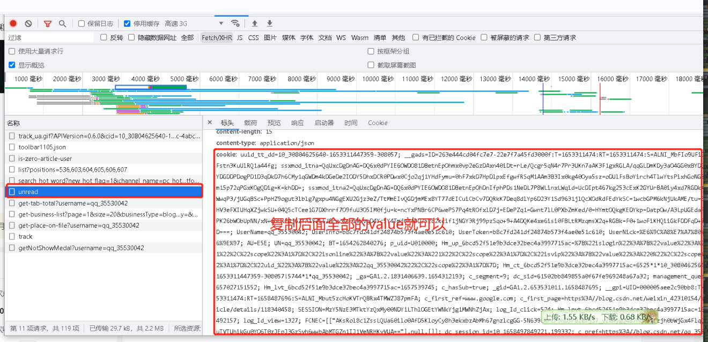
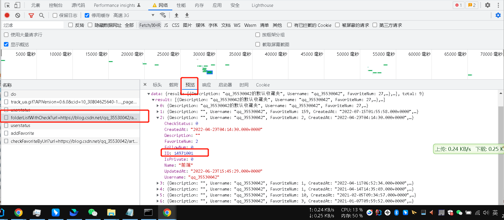

# 根据接龙链接进行三连
接龙文章如果一个个回复太过于繁琐太浪费时间了，所以搞了个根据接龙链接进行三连

> 大家自用互助，千万别干坏事，仅作为学习交流~
>
> 

## 使用说明
> 
> 运行前提是Java环境哈，考虑大家不一定是Java开发所以这里贴个教程 
> 
> [jdk mac环境安装](http://t.csdn.cn/bhzhs)
> 
> [jdk window环境安装](http://t.csdn.cn/yT8RU)
> 
> [idea 配置详解](http://t.csdn.cn/5b6AL)
> 
> 然后按下面的修改做即可
> 

1. 获取你的cookie(登录你的个人页，打开浏览器调试F12，随便找一个请求点开，复制如图的value) 粘贴到 top.chen.fansback.common.cmd.CsdnRequest.CSDN_COOKIE 字符串
   

2. 到 top.chen.fansback.common.cmd.CsdnRequest 类的 OWNER变量 配置自己的name（打开自己的主页，比如我的：https://blog.csdn.net/qq_44590469?type=blog ） qq_44590469就是我的name

3. 配置收藏夹id，收藏文章都会到这个文件夹（top.chen.fansback.common.cmd.CsdnRequest类的 defaultFavFoldId变量）
   这个在电脑上点收藏的时候，打开浏览器的调试（F12），选到网络-选择fetch/xhr , 然后点一下收藏（会出来收藏列表）,选择你想把三连保存到哪个收藏夹下的id复制到这
   

4. top.chen.fansback.common.spider.csdn.BackFansSpider.run 程序入口 粘贴接龙链接

   ```
   jieLongSanLian(""); //""内写入接龙内容
   eg:jieLongSanLian("#接龙
   8月8日
   1. CSDN Flyme awei 
   超详细的非常适合新手学习的Python组合数据类型--列表
   http://t.csdn.cn/GeJVW
   2. 花神庙码农@CSDN http://t.csdn.cn/qAO0I
   3. 小小马车夫 http://t.csdn.cn/6WNZK  三连必回，有关必回
   4. 秃秃爱健身 http://t.csdn.cn/pRahA 三连必回（高原力等级、高权重）
   5. 小鹏linux 
   
   高原力等级+vip高权重在线回访http://t.csdn.cn/eazvm
   6. @每天都要敲代码 
   http://t.csdn.cn/zpPwk
   7. CSDN-蜡笔雏田学代码 http://t.csdn.cn/JnnFz 优质互奶家人们️
   8. 祁画 http://t.csdn.cn/1L4dr新文章，apifox为何如此受青睐，兄弟们互相支持一波
   9. CSDN-TimeFriends https://timefriends.blog.csdn.net/article/details/126099694?spm=1001.2014.3001.5502 互相帮助一波
   10. CSDN-职场人 https://blog.csdn.net/m0_63592370/article/details/126208822?spm=1001.2014.3001.5501 互奶
   11. CodeMak1r. 
   
   Hooks:http://t.csdn.cn/LPhWO
   12. promise https://blog.csdn.net/m0_71485750/article/details/126183390  互三互关
   13. 凉城 http://t.csdn.cn/egL93兄弟们给小杨来波关注三连吧，看见了就回大家
   14. Lee
    http://t.csdn.cn/wOCMN
   互关三连一下叭，看到就回
   15. 雨安 https://blog.csdn.net/m0_66318554/article/details/126213992优质互三，🉑关注
   16. if 
   http://t.csdn.cn/ss38g
   17. CSDN进击的博仔 https://blog.csdn.net/weixin_45773137/article/details/126225061
   诚信互三")
   ```

## 配置项&说明
1. 评论的文案：top.chen.fansback.common.BackProperties 这里面(欢迎大家提交新的文案供大家参考)
2. 点赞每天有限制
3. 评论每分钟限流3条

   

### 如有问题可以联系群主


